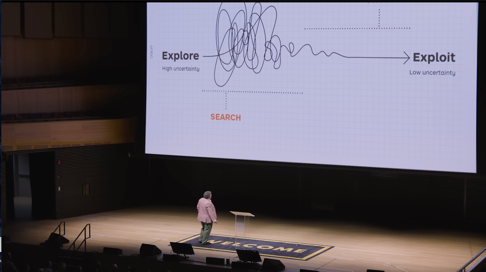

I spent many hours over the holiday break wrestling with Docker path mappings on my homelab server. Multiple open source apps, each expecting files in slightly different locations. Mount points that worked for one broke another. Environment variables that I had to continually down and up the stack to test.

So I did what we all do now: I asked an AI.

Ten minutes later, I had it all working. Problem solved.

But I didn't feel anything.
No sense of accomplishment, no **Joy**. 

The server was running, but I hadn't learned anything.

## What I Lost

Here's what didn't happen: I didn't dig into the documentation. I didn't join the project's Discord to ask questions. I ceratinly didn't hit stack overflow, I didn't stumble into a conversation about why the maintainers made certain architectural choices. I didn't meet another hacker struggling with the same issue who might enjoy knowing his advice helped me. 

I got my answer. But I missed the community.

In the old way - the pre-AI way - getting stuck meant reaching out. You'd search Stack Overflow and find someone who'd hit the same wall. You'd post in a forum and wait for responses. Sometimes you'd get crickets. Sometimes you'd get a grumpy RTFM. But often, you'd get a thoughtful answer from someone who'd been there, and maybe a follow-up conversation, and maybe you'd help them with something next week.

So many examples of this, I got an outsized appreciation for my 20min spent sharing this simple experience https://www.aaronheld.com/post/reading-exchange-mail-with-java/ with the community.  Community has always been a major aspect of why I enjoy what I do for a living.

The friction was the point. Diverse groups around the world solving friction created connections.

## The Efficiency Trap

Every AI product pitch follows the same script: eliminate friction, reduce headcount, reduce wait time, get answers instantly. Customer support without the support team. Documentation you never have to read. Problems solved without the messy overhead of other humans.

It's pure quantitative thinking. Time to resolution. Number of support tickets closed. Lines of code generated per hour.

This is where Rory Sutherland's talk "[Alchemy: The Surprising Power of Ideas That Don't Make Sense](https://youtu.be/lhlS-Wds02M?si=9X0O89IJ9nyrle3u)" cuts through the noise. He argues that businesses - especially tech businesses - have become obsessed with the quantifiable at the expense of the qualitative. We optimize for measurable efficiency and miss what actually matters.

Getting my Docker apps working isn't the point. The point is what I might have learned. Who I might have met. What understanding I might have built that would help me with the next problem, or help someone else with theirs.

But that's not quantifiable. You can't put "accidentally made a friend in a Discord channel" on a quarterly metrics dashboard. You can't measure "developed intuition about how these systems work." You can't track "felt part of something larger than myself."

So we optimize it away.

Sutherland also frames an imbalance between explore and exploit phases. Businesses favor exploit - the low uncertainty, high predictability of extracting value from what's already known. It's measurable. It's plannable. It fits in a spreadsheet.

Explore is messier. High uncertainty. You don't know what you'll find. Maybe you waste time in a forum thread that goes nowhere. Maybe you learn something unexpected. Maybe you build a relationship that pays off three years later in ways you can't predict now.

We need both. But the ratio has swung too far toward exploit.

Another fun observation from his talk. Finance gets a veto. If the CFO says "this doesn't make financial sense," the project dies. But the creative, the intuitive, the person who sees the qualitative value? We just get an opinion. We never get veto rights over a "rational" choice.

I've watched this play out dozens of times. My intuition rages against the rational choice. But something feels wrong - and that feeling doesn't get a veto. The ["Innovators Dilemma"](https://booksthatslay.com/the-innovators-dilemma-summary/) was a formative book in my early managment days, and the lession is still being learned. 

There is so much evidence about the importance of exploration, feelings, qualitative, even in my SRE world.  Kubernetes, Servers, uptime, the most quantifiable domain you can imagine - I once reported an 85% reduction in business-impacting incidents. Eighty-five percent. The metrics were undeniable.

An exec challenged me anyway. Why? Because a key customer had mentioned something "didn't look right" on one of our apps. Not broken. Not down. Just not right.

The customer's perception mattered more than my metrics. At the end of the day, perception shapes reality more than numbers ever will.

## The Scarcity Shift

But here's where Sutherland's reframe gets interesting for the AI doomsayers: scarcity creates value.

AI is making information abundant. Answers are free. Solutions are instant. Code writes itself. Customer questions get resolved without humans ever touching them.

Which means authentic human connection is about to become scarce. Really scarce.

And what happens when something becomes scarce? Its value skyrockets.

Think about handwritten letters in the age of email. Vinyl records in the streaming era. Face-to-face meetings after years of Zoom. The less common something becomes, the more we treasure it when we get it.

Right now, we're optimizing for a world where AI handles the transactional, the predictable, the efficient. Fine. But that means the human stuff - the messy, uncertain, qualitative experiences - becomes the premium offering.

The community forum where someone takes time to explain not just the answer but the reasoning. The open source maintainer who hops on a call to talk through an architectural decision. The Discord channel where people help each other not because it's their job, but because they actually care.

These experiences won't disappear. But they'll become precious.

2026 might be the year we realize this. The year we stop treating human connection as friction to eliminate and start treating it as the scarcest, most valuable resource we have.

## What This Means for 2026

So what does this look like practically?

I think we'll see a split. Companies will continue automating everything they can measure. AI will handle support tickets, generate code, answer questions. The quantitative side of business will become even more efficient.

But the people who win - the products that matter, the communities that thrive, the careers that flourish - will be the ones who double down on the qualitative.

**The open source projects that invest in community, not just code.** Weekly office hours. Real-time chat with maintainers. In-person meetups at conferences. The stuff that doesn't scale becomes the moat.

**The companies that treat human connection as a feature, not overhead.** The support team that actually knows your name. The customer success manager who remembers your context. The CEO who still does customer calls even though "it doesn't scale."

**The professionals who build networks through actual relationships.** Not LinkedIn connections. Not Twitter followers. Real people who know your work, trust your judgment, and would take your call.

This isn't nostalgia for the old way. I'm not saying we should reject AI or go back to posting on phpBB forums. I use AI every day. It's incredibly useful.

But I'm going to be more intentional about where I let efficiency win and where I choose the messier, human path.

## Back to the Homelab

Next time I get stuck configuring something, I might still ask an AI first. But I'm also going to join that Discord. Read the documentation. Ask a dumb question in the forum.

Not because it's more efficient. Because the point isn't just getting my apps to work.

The point is being part of something. Learning from people. Building relationships that might matter later in ways I can't predict.

If Sutherland is right - and I think he is - authentic human connection is about to become the scarcest, most valuable thing we have.

2026: Year of Community.

Not because we're rejecting technology. Because we're remembering what technology can't replace, and nostolgic for when society had no alternative to community.