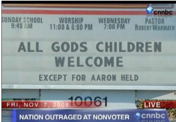

The combination of cutting edge on-demand video creation and old school guilt!  

Watch it 

---

_Edit from 2025:
Back in 2008 I really thought we would be doing more of this on demand video creation. Now that AI is here I do expect to see this again.  But this spot proved we had the technology back then.  It was easy to insert text or product placement into videos and skilled designers make it seamless and interesting. It's a bit sad that this will come to fruition with AI making soulless art because the business teams have no concept of the creative design process.  What's worse is that people will be amazed and accept this drek, never able to imagine what could have been._

The video is not online anymore, the entire domain is down. But this was the link to the video note my name in the url: http://www.cnnbcvideo.com/?combined=Aaron%20Held&first=Aaron&name_id=9406856&last=Held&id=-13807711-QWQp3rx&nid=PlqECJgn8MZulM9kXVhqvDk0MDY4NTY-

This was creative and funny (at the time)

---
