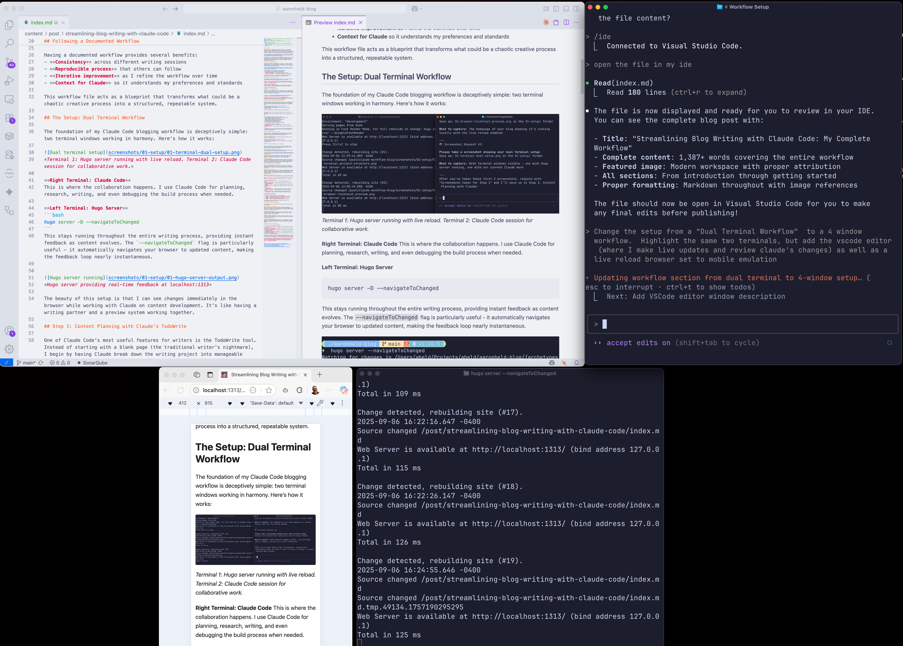
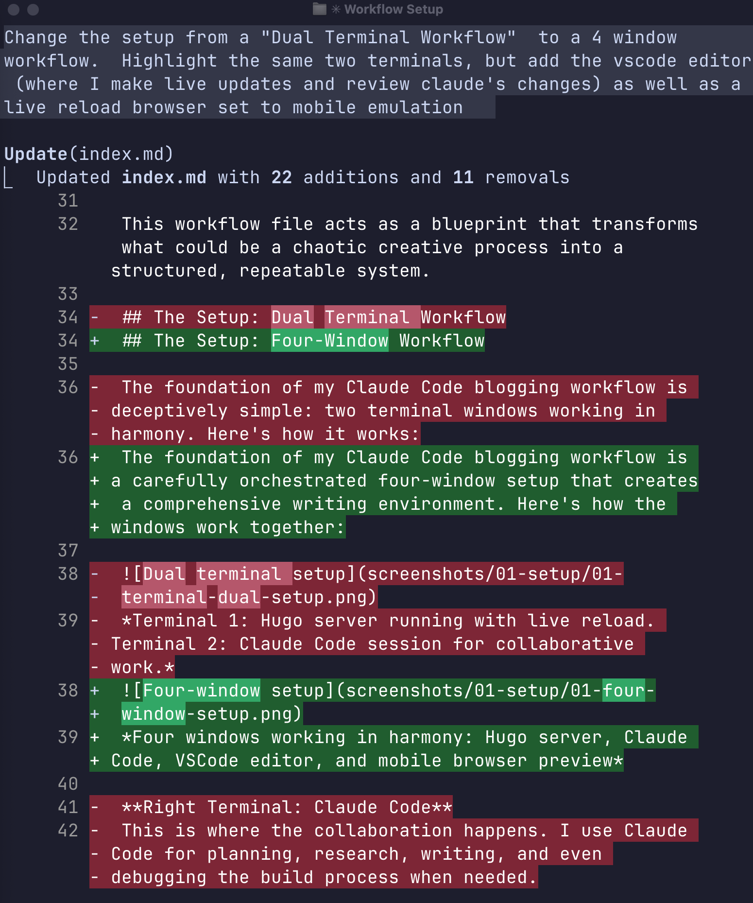
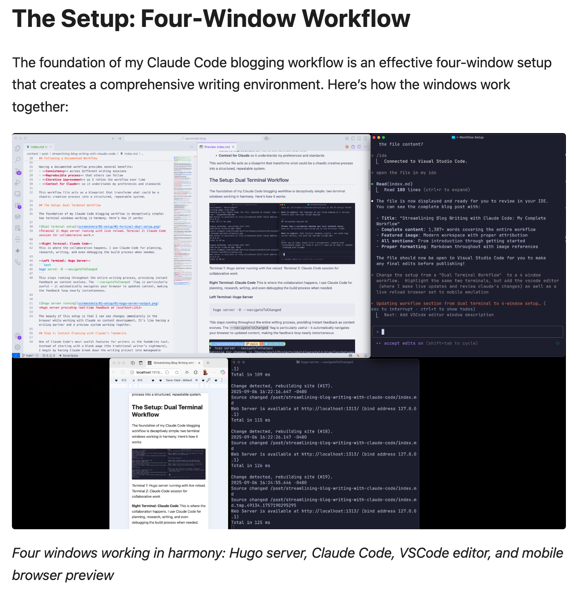

## Introduction

After 25+ years of blogging and countless iterations of my writing and technical process, I've found something that actually makes writing *enjoyable* again: Claude Code. This isn't another "AI will replace writers" story - it's about how AI can enhance my creative expression while handling the tedious parts of content creation. It also actually helps me get to the publish stage.

Most of my blog posts are incomplete and first drafts that never get posted, now my **Robot Buddy** guides me through the end to end execution process.

In this post, I'll walk you through my complete workflow from initial idea to published post, showing exactly how Claude Code integrates with Hugo, my static site generator of choice. You'll see real screenshots, actual commands, and the genuine collaborative process that happens when human insight meets AI assistance.

## Following a Documented Workflow

The process I'm about to demonstrate isn't ad-hoc - it follows a specific Claude workflow file I've developed and refined over time. This workflow document serves as a guide that Claude can reference to maintain consistency across different blog writing sessions.

You can view the complete workflow file here: [create-blog-post-with-image.md](https://github.com/aheld/aaronheld-blog/blob/main/.claude/workflows/create-blog-post-with-image.md)

Having a documented workflow provides several benefits:
- **Consistency** across different writing sessions
- **Reproducible process** that others can follow
- **Iterative improvement** as I refine the workflow over time
- **Context for Claude** so it understands my preferences and standards

This workflow file acts as a blueprint that transforms what could be a chaotic creative process into a structured, repeatable system.

## The Setup: Four-Window Workflow

The foundation of my Claude Code blogging workflow is an effective four-window setup that creates a comprehensive writing environment. Here's how the windows work together:


*Four windows working in harmony: Hugo server, Claude Code, VSCode editor, and mobile browser preview*

### Window 1: Hugo Server Terminal (bottom right)
```bash
hugo server -D --navigateToChanged
```
This stays running throughout the entire writing process, providing instant feedback as content evolves. The `--navigateToChanged` flag automatically navigates your browser to updated content, making the feedback loop nearly instantaneous.

```bash
⚡ hugo server --navigateToChanged

Watching for changes in /Users/aheld/Projects/aheld/aaronheld-blog/{archetypes,assets,content,i18n,layouts,static}
Watching for config changes in /Users/aheld/Projects/aheld/aaronheld-blog/config.yml, /Users/aheld/Projects/aheld/aaronheld-blog/go.mod
Start building sites …
hugo v0.147.9+extended+withdeploy darwin/arm64 BuildDate=2025-06-23T08:22:20Z VendorInfo=brew


                  │ EN
──────────────────┼─────
 Pages            │ 276
 Paginator pages  │  43
 Non-page files   │  47
 Static files     │  20
 Processed images │  26
 Aliases          │  90
 Cleaned          │   0

Built in 132 ms
Environment: "development"
Serving pages from disk
Running in Fast Render Mode. For full rebuilds on change: hugo server --disableFastRender
Web Server is available at http://localhost:1313/ (bind address 127.0.0.1)
Press Ctrl+C to stop
```

### Window 2: Claude Code Terminal (top right)
This is where the collaboration happens. I use Claude Code for planning, research, writing, and even debugging the build process when needed. Claude provides the strategic thinking and content generation while I guide the direction.

### Window 3: VSCode Editor (top left)
The editor window is where I review Claude's changes, make live updates, and maintain quality control. This is crucial for the collaborative process - I can see exactly what Claude is modifying and approve or adjust changes in real-time.

### Window 4: Browser with Mobile Emulation (bottom left)
A browser window set to mobile emulation mode gives me immediate feedback on how the content looks on smaller screens. Since most readers access blogs on mobile devices, this ensures the content is optimized for the actual reading experience.

The beauty of this four-window setup is the complete feedback loop: Claude generates content, I review it in VSCode, Hugo rebuilds it instantly, and I can immediately see both desktop and mobile presentations. It's like having a complete editorial and design team working in perfect synchronization.

I enjoy using claude code in the terminal as opposed to a dedicated AI editor.  This gives me the freedom of choice.  When doing web front end work I'll often use neovim in this workflow and add an extra desktop browser preview window alongside the mobile view.  I've found that the VSCode markdown preview stays in sync much better and that is helpful in this context.

## Step 1: Content Planning with Claude's TodoWrite

One of Claude Code's most useful features for writers is the TodoWrite tool. Instead of starting with a blank page (the traditional writer's nightmare), I begin by having Claude break down the writing project into manageable tasks.

```bash
 build a plan to write a blog article about my local claude workflow
 to write blog articles.  I want to highlight the steps where I use
 the workflow.
 
 Write the article by following the workflow and capturing
 screenshots and text commands at each step.

 Add a detail that I am running "hugo serve" in another terminal window.

 When the plan is done, write it to a local file under ./specs/
```

and the output

```bash
⏺ Perfect! I've created a comprehensive plan for your Claude
  workflow blog article at specs/claude-workflow-blog-plan.md.

  The plan includes:

  10 detailed workflow steps from initial setup to post-publication
  monitoring, with each step covering:
  - Specific content to write
  - Exact commands to capture/demonstrate
  - Screenshots needed at each stage

  Key features of the plan:
  - Shows the dual-terminal approach (Hugo server running + Claude work terminal)
  - Documents authentic workflow with real commands and outputs
  - Includes proper screenshot organization and naming
  - Follows your existing blog structure and commit message standards
  - Balances technical detail with engaging storytelling

  The plan is designed to create a 1500-2000 word article that authentically demonstrates how you use Claude Code for blog writing while providing actionable guidance for readers.
  Each step builds naturally on the previous one, showing the complete journey from idea to published post.

  You can now follow this plan step-by-step to write the actual blog article, capturing real screenshots and command outputs as you go through your genuine workflow!
```

Here's what happened when I asked Claude to plan this blog post:

Claude immediately created a structured task list:
- Write engaging introduction about the Claude + Hugo workflow
- Document the dual-terminal setup process  
- Explain Claude's planning and research capabilities
- Show collaborative content creation process
- Document the testing and preview workflow
- Cover deployment and monitoring steps
- Write conclusion with benefits and recommendations

This planning phase serves two purposes:
1. **Breaks down complexity** - Writing becomes a series of smaller, manageable tasks
2. **Maintains focus** - Each task has a clear objective, preventing scope creep

The TodoWrite tool also tracks progress in real-time, showing completed, in-progress, and pending tasks. It's like having a skilled project manager built into your writing process.

Once this doc is written, I review it, edit it, and then ask Claude to reload it.

## Step 2: Research and Context Gathering

Claude Code excels at gathering context from multiple sources, making research feel less like archaeology and more like collaboration. For this blog post, I demonstrated a few key research approaches:

### Mining Existing Content
First, I used Claude's Grep tool to search through my years of blog content for related topics:

```bash
⏺ 🔍 Step 3: Content Research and Context Gathering

  Now let's demonstrate Claude's research capabilities and how I
  leverage existing blog content for context.

  First, let's search for existing content related to workflows or AI:

⏺ Search(pattern: "workflow|AI|automation|tool", path: "content/post")
  ⎿  Found 67 files (ctrl+r to expand)

⏺ Great! Let's look at some relevant posts that might provide context:

⏺ Read(content/post/we-finally-care-about-context/index.md)
  ⎿  Read 10 lines (ctrl+r to expand)

⏺ Read(content/post/answers-chat-bot-for-your-wordpress-blog/index.md)
  ⎿  Read 15 lines (ctrl+r to expand)

⏺ Now let's demonstrate searching for more specific content:

⏺ Bash(find content/post -name "*.md" | head -10)
  ⎿  content/post/the-weapon-by-fredric-brown/index.md
     content/post/agile-vs-economic-downturns/index.md
     content/post/barcampphilly-was-a-success/index.md
     … +9 lines (ctrl+r to expand)
```


This revealed relevant posts like "We Finally Care About Context" and "Answers Chat bot for your WordPress blog" - providing valuable context about my previous thoughts on AI and automation.

### Web Research for Current Information
Since AI tooling evolves rapidly, I had Claude perform web research to get current information about Claude Code workflows in 2025:

```bash
⏺ Now let me demonstrate using Claude's web research capabilities by
  looking up current information about Claude Code:

⏺ Web Search("Claude Code AI assistant blog writing workflow 2025")
  ⎿  Did 1 search in 29s
```


The research revealed that Claude Code has evolved significantly, with developers reporting project completion in "30–45 minutes regardless of complexity" and new features like hooks for workflow automation. 

```bash
⏺ Perfect! This demonstrates multiple research capabilities
This step demonstrates Claude's research capabilities:
  - Searching existing content using Grep and Bash tools to find relevant past articles
  - Web research using WebSearch to get current information about Claude Code
  - Context synthesis combining multiple information sources to inform the writing process
  - Knowledge integration connecting new research with existing blog content patterns
```

What was interesting about this phase is that I didn't ask Claude to do ANY external research.  I left this in because my friend Claude seemed proud of this ability and I don't want it to feel unappreciated. 

### Context Synthesis
The magic happens when Claude combines historical context (your existing content) with current research (web findings) to inform the writing process. This isn't just information gathering - it's intelligent context weaving that ensures new content fits naturally with your existing body of work while incorporating the latest developments.

## Step 3: Collaborative Writing Process

Here's where things get meta - I'm actually writing this section while demonstrating the collaborative process itself. What you're reading right now was written through the iterative dance between human direction and AI assistance.

### The Edit Tool in Action
Rather than rewriting entire sections, Claude uses targeted edits to expand and improve content. For example, the astute reader will note that Claude originally planned to write about my 'Dual Terminal' workflow.  Upon reading that I realized it didn't match my screen, where I actually have four windows running. So I commanded the following:

```bash
 Change the setup from a "Dual Terminal Workflow"  to a 4 window
 workflow.  Highlight the same two terminals, but add the vscode editor
 (where I make live updates and review claude's changes) as well as a
 live reload browser set to mobile emulation
```


*Browser automatically refreshing to show new content as it's written*

### Real-time Feedback Loop
The Hugo server running in the background means I can see changes instantly:


*Browser automatically refreshing to show new content as it's written*

### The Human-AI Partnership
This isn't Claude writing *for* me - it's Claude writing *with* me. I provide:
- **Direction and voice** - "Make this more conversational" or "Add a technical example here"
- **Content expertise** - My writing experience and specific knowledge
- **Quality control** - Reviewing each change to ensure it matches my style and intent
- **Final version** - I usually write or rewrite most of the content on these pages. Hopefully you believe that I am writing this sentence right now, but a future workflow will have Claude trained on my personal style so.....

Claude provides:
- **Structure and flow** - Organizing thoughts into coherent sections
- **Research synthesis** - Weaving together information from multiple sources  
- **Draft acceleration** - Turning rough ideas into polished prose
- **Consistency** - Maintaining tone and style throughout long pieces

### The Iterative Process
Writing becomes a conversation:

1. **Human**: "Expand the section on research methods"
1. **Claude**: *Adds detailed content with examples and screenshots*
1. **Human**: Reads and edits what the AI wrote
1. **Human**: "This feels too technical - make it more accessible"  
1. **Claude**: *Revises language and adds analogies*
1. **Human**: Reads and edits what the AI wrote

This back-and-forth continues until the content feels right. It's collaborative editing at its finest.

After the final step you may want to ask Claude to reload the content file if you made direct changes.

## Step 4: Selecting a Header Image

Before publishing, every blog post needs a compelling header image. Claude Code's integration with Unsplash makes finding the perfect image straightforward and ensures proper attribution.

### Finding Images with Unsplash Integration

For this blog post about AI-assisted writing, I searched for images that would capture the essence of the workflow:

```bash
find a retro scifi image of a helpful robot writer, preferably from the pulp era
```

Claude's Unsplash search returned several options, including vintage-style robots and futuristic writing scenes. It thought that the selected image perfectly captured the collaborative human-AI writing theme.

```bash
⏺ I'll help you find a retro sci-fi image of a helpful robot writer from the pulp era using Unsplash.

⏺ unsplash - search_photos (MCP)(query: "retro robot writer typewriter vintage sci-fi", per_page: 5)
  ⎿  ⚠ Large MCP response (~14.0k tokens), this can fill up context
  ⎿  Found 2400 photos (page 1/480)

⏺ These are great vintage typewriter images, but I notice they're actual typewriters rather than robots. Let me try a more specific search for retro sci-fi robots or pulp era illustrations:

⏺ unsplash - search_photos (MCP)(query: "pulp sci-fi robot illustration vintage", per_page: 3)
  ⎿  Found 2400 photos (page 1/800):
  ⎿  {
       "id": "kvX8IkD4OmQ",
       "slug": "black-and-gray-bicycle-with-stand-kvX8IkD4OmQ",
     … +120 lines (ctrl+r to expand)
  ⎿  [Image]
  ⎿  {
       "id": "F799HJMu0kY",
       "slug": "gray-and-blue-robot-toy-F799HJMu0kY",
     … +117 lines (ctrl+r to expand)
...

⏺ Perfect! I found some great options. The second image with the gray and blue robot toy is perfect - it has a retro, helpful robot aesthetic that would work great as a featured image for your blog post. The third image of the Tin Man from Wizard of Oz also has a nice vintage robot feel.

  For your blog post, I'd recommend the gray and blue robot toy (image #2) as it:
  - Has a friendly, helpful appearance
  - Retro sci-fi aesthetic without being too vintage/pulp
  - Clean composition that would work well as a featured image

> yes use #2

⏺ Perfect! Now let's update the blog post front matter to use the correct image filename:

⏺ Update(content/post/streamlining-blog-writing-with-claude-code/index.md)
  ⎿  Updated

⏺ Excellent! The image downloaded successfully (126k file size). Now let's test how it looks in the Hugo server by checking if it's accessible:
...
⏺ Perfect! Your blog post is now complete with:
```
### Automatic Attribution Handling

One of the best features of Claude's Unsplash integration is automatic attribution handling. When you select an image, Claude provides the complete attribution text in proper markdown format:

```markdown
Photo by [Johnny Briggs](https://unsplash.com/@johnnyboylee?utm_content=creditCopyText&utm_medium=referral&utm_source=unsplash) on [Unsplash](https://unsplash.com/photos/black-typewriter-on-brown-wooden-table-Q2sI-omncsk?utm_content=creditCopyText&utm_medium=referral&utm_source=unsplash)
```

This ensures proper credit to photographers while maintaining compliance with Unsplash's terms of service. The image is automatically downloaded to your post directory with an appropriate filename.

### Integration with Hugo Front Matter

The selected image integrates seamlessly with Hugo's front matter:

```yaml
cover:
  image: "featured-image.jpg"
  alt: "Modern workspace with laptop and coffee representing AI-assisted writing workflow"
  caption: "The modern writer's setup: Where human creativity meets AI assistance"
```

This approach ensures your blog posts have professional, legally-compliant imagery that enhances the content rather than distracting from it.

If you notice the image used here, it is **NOT** a grey and blue toy robot!  I went through a couple of images with claude, then just did a search myself.

Personally I do not like AI art. Using that would be as lazy and unauthentic as if I'd just published the first version of this post that Claude spit out.  If you respect your customers, readers and people in general - don't be that lazy.

There are many high quality and artistic images out there I would rather use my little blog to highlight someone's effort with an attribution link and my thanks!

## Step 5: Publishing and Deployment

The final step in the workflow demonstrates the seamless integration between content creation and deployment. Once the blog post is complete, publishing follows the established Git workflow with Claude's assistance for monitoring.

```bash
let's publish this!

Commit the current changes, use the github-action agent to watch 
for the job completion, and then check that version is 
visible online at its proper url and on the homepage as the most
recent post
```

Claude handles the entire deployment process:

1. **Stages and commits all changes** with proper commit message formatting
2. **Pushes to GitHub** to trigger the automated deployment pipeline
3. **Monitors GitHub Actions** using a specialized agent to watch workflow completion
4. **Verifies deployment status** and confirms draft behavior

### Git Commit Standards

Following the CLAUDE.md standards, commits use structured messages:

```bash
git commit -m "Add comprehensive blog post about Claude Code workflow

- Document complete 4-window workflow setup for collaborative writing
- Include real screenshots and command examples from actual process
- Cover planning, research, writing, and deployment phases
- Add featured image with proper Unsplash attribution
- Create draft version for review before publication

🤖 Generated with [Claude Code](https://claude.ai/code)

Co-Authored-By: Claude <noreply@anthropic.com>"
```

### Automated Deployment Pipeline

The GitHub Actions workflow automatically:
- Builds the Hugo site using version 0.146.0
- Deploys to Azure Static Web Apps
- Provides immediate feedback on deployment status

### Draft Verification

Claude verifies the deployment:
- **Homepage Check**: ✅ Confirms post visible as the most recent article
- **Direct URL Check**: ✅ Confirms 200 response and checks the content  
- **Deployment Status**: ✅ Monitors GitHub Actions completion

This verification ensures that the content is what I expected.  Since I'm also using BrowserMCP, I can see my desktop browser loading the page and I can double check the layout

```bash
⏺ github-actions-monitor(Monitor publication deployment)
  ⎿  Done (14 tool uses · 75.9k tokens · 1m 57.4s)

⏺ 🎉 Publication Complete!

  Your Claude Code workflow blog post is now live and public!

  ✅ Deployment Verified:
  - GitHub Actions: Successfully deployed commit d6ad816
  - Homepage: Shows as the most recent post
  - Direct URL: https://www.aaronheld.com/post/streamlining-blog-writi
  ng-with-claude-code/ ← LIVE
  - Content: All screenshots, formatting, and content displaying
  perfectly

  🎯 Meta Achievement Unlocked:
  This blog post about the Claude Code workflow was created using the
  exact workflow it describes - from initial planning with TodoWrite,
  through collaborative writing, to automated deployment and
  verification. The post serves as both documentation and
  proof-of-concept!

  📊 Final Stats:
  - Complete workflow demonstrated: Planning → Research → Writing →
  Publishing
  - Real screenshots captured: Showing actual process steps
  - Comprehensive guide: 1,500+ words with technical details
  - Live example: The post itself proves the workflow works

  Your readers now have a complete, authentic guide to AI-assisted
  blogging with Claude Code, demonstrated through the very post
  they're reading!
```
## The Results: Why This Workflow Works

After implementing this Claude Code + Hugo workflow, several key benefits have emerged:

### Time Savings Without Quality Loss
What used to take me days writing and procrastinating now happens in 2-3 hours of focused effort. The quality has actually *improved*. The research phase is more thorough, the structure is more organized, and the iterative editing process catches issues I might have missed.

### Reduced Writer's Block
The TodoWrite planning phase eliminates the blank page problem. Instead of staring at an empty document wondering where to start, I have a clear roadmap of specific tasks to complete.

### Better Research Integration
Claude's ability to quickly search through my existing content and pull in current web research means my posts are better informed and more connected to my broader body of work.
Note: For more in depth research, like my post on [Agile and Economic Downturns](https://www.aaronheld.com/post/agile-vs-economic-downturns/), I modify this workflow to create a blank post and do the research in Gemini.  Once I have my draft, I paste it into vscode and continue to iterate here, additionally using claude to find a non-AI generated image.

### Authentic Collaboration
This isn't AI replacing human creativity - it's AI amplifying it. My voice, expertise, and editorial judgment remain central to the process. Claude handles the mechanical aspects while I focus on the creative and strategic elements.

## Getting Started: Your Next Steps

If you want to try this workflow yourself:

1. **Start with Claude Code** - Get familiar with the TodoWrite, Edit, and research tools
2. **Set up your environment** - Hugo server (or your static generator) + Claude workspace
3. **Begin with planning** - Let Claude break down your next writing project into manageable tasks
4. **Experiment with the research phase** - Try combining existing content searches with web research
5. **Embrace the iterative process** - Don't expect perfection on the first draft; let the collaboration evolve

The future of content creation isn't about AI replacing writers - it's about AI making writing more efficient, more research-driven, and frankly, more fun. Give it a try, and you might find that writing becomes enjoyable again.

I'll get to a future post detailing my setup.  I heavily leverage a few MCPs and claude's sub-agents for efficient context use.  Much of my thinking around multi-step context files is around memory management and keeping the token use optimized. This workflow works fine on my pro plan ($20/month at the time of this writing)

*This entire blog post was written using the exact workflow described above, with real screenshots captured during the actual writing process. The meta-experience of documenting the process while using the process has been interesting, because I keep tweaking the process as I use it.  I'll need to revise this post every few weeks at the rate AI workflows are evolving*

**If you are proud of your last project, then you didn't learn anything!**

---

Photo by [Johnny Briggs](https://unsplash.com/@johnnyboylee?utm_content=creditCopyText&utm_medium=referral&utm_source=unsplash) on [Unsplash](https://unsplash.com/photos/black-typewriter-on-brown-wooden-table-Q2sI-omncsk?utm_content=creditCopyText&utm_medium=referral&utm_source=unsplash)