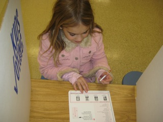
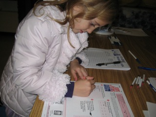

The vote turnout is really impressive. Its more like a party or superbowl.

Normally people are quiet while waiting online to vote, and if there is conversation is complaining about the need to wait.  

Even the tv spots this election were a higher production quality as compared to years past. Maybe we need to let Fox and CNN bid for exclusive coverage rights.

Anyway after I voted I took the kiddies to vote at the Bucks county kid election:  

The culture is so different now.

What is next for civil duties? People actually wanting to serve on Juries?
